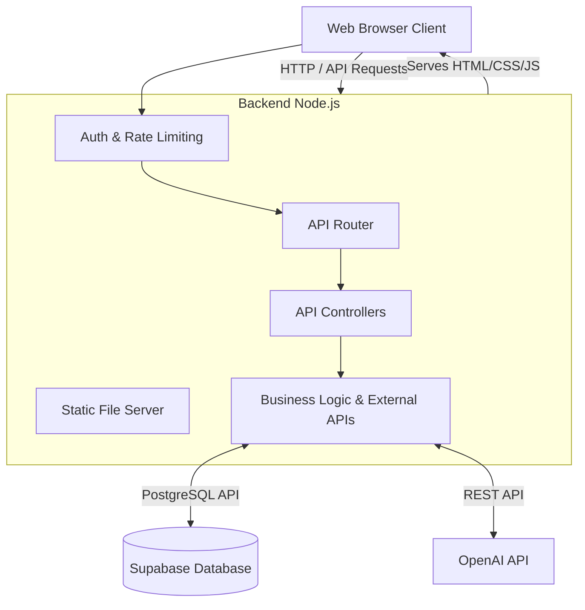
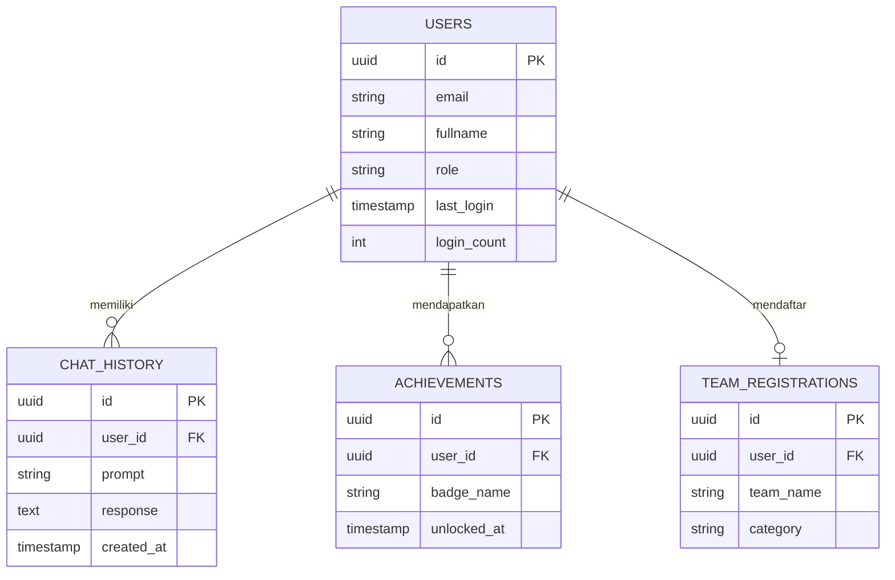
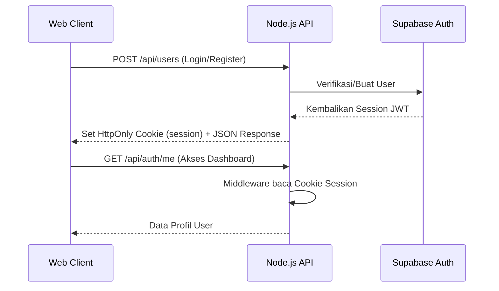

# NovaMind Hub
    

NovaMind Hub adalah platform kompetisi dan pembelajaran inovasi untuk mahasiswa. Proyek ini membantu peserta mendaftarkan tim, memakai mentor AI, memantau aktivitas, mengembangkan kesiapan inovasi, dan mengakses sumber belajar melalui satu pengalaman web yang konsisten.


> *Placeholder: Ganti dengan screenshot halaman Dashboard asli sebelum presentasi.*

## Tujuan Proyek
NovaMind dirancang untuk menjembatani ide mahasiswa dengan proses inovasi yang terstruktur. Platform menggabungkan informasi kompetisi, alat evaluasi, pendampingan AI, pelacakan progres, gamifikasi, dan administrasi data dalam arsitektur *full-stack* yang aman dan siap untuk *deployment* (Production-Ready).

## Arsitektur Sistem



Sistem ini menggunakan arsitektur *Monolithic* sederhana berbasis Node.js murni (tanpa framework seperti Express), yang melayani konten statis (HTML/CSS/JS) sekaligus menyediakan RESTful API backend di port yang sama. Frontend melakukan komunikasi secara dinamis ke backend melalui Fetch API.

## Entity Relationship Diagram (ERD)



## Struktur Folder
```text
NovaMind/
├── assets/              # Logo, gambar, dan file dependency (CSS/JS vendor)
├── config/              # Validasi environment dan konfigurasi DB
├── controllers/         # Logika HTTP request dan response API
├── database/            # Skema SQL Supabase & sistem penanganan error
├── docs/                # OpenAPI dan dokumentasi gambar
├── http/                # Helper untuk static file dan JSON routing
├── middleware/          # Otentikasi, Admin Guard, dan Rate Limiting
├── models/              # Struktur data dan pemetaan tabel
├── routes/              # Pendaftaran endpoint API
├── services/            # Komunikasi ke database Supabase & integrasi AI
├── *.html               # Halaman UI Frontend
├── server.js            # Entry point backend utama
└── README.md            # Dokumentasi utama proyek
```

## Teknologi
| Lapisan | Teknologi |
|---|---|
| Frontend | HTML5, CSS, Bootstrap 5, Vanilla JavaScript |
| Animasi/Visual | GSAP, ScrollTrigger, Swiper, Chart.js |
| Backend | Node.js (Vanilla HTTP module) |
| Database | Supabase PostgreSQL |
| Authentication | Supabase Auth (JWT, HttpOnly cookies) |
| Integrasi AI | OpenAI API (gpt-4o-mini) |

## Database Supabase
Skema tersimpan di `database/schema.sql`. Tabel utama:
- `users`: Profil pengguna, *role*, jumlah akses, waktu login.
- `chat_history`: Riwayat lengkap dialog AI.
- `achievements`: Sistem *badge* gamifikasi.

## Authentication & API Flow


Menggunakan sistem *Session & Cookies*. Autentikasi dilakukan via Supabase, lalu backend mengeluarkan *HttpOnly cookies* (Aman terhadap serangan XSS) ke browser pengguna untuk menjaga sesi login.

## Admin Dashboard
Tersedia halaman khusus Administrator di `admin-dashboard.html`. Halaman ini **hanya** dapat diakses oleh akun yang memiliki hak `role = 'admin'`. Di dalamnya terdapat:
- Visualisasi metrik total pengguna, total chats, dll (Menggunakan Chart.js).
- Tabel transparan pengguna terbaru dan interaksi AI terbaru.

## Achievement System
Sistem secara proaktif memantau aktivitas pengguna dan akan membuka kunci *badge* (seperti *First Login*, *Active Learner*, dsb.) saat syarat terpenuhi.

## Cara Install dan Menjalankan (Lokal)
1. Instal dependensi:
   ```bash
   npm install
   ```
2. Duplikat file environment:
   ```bash
   cp .env.example .env.local
   ```
3. Konfigurasi `.env.local` (lihat panduan di bawah).
4. Mulai server:
   ```bash
   npm start
   ```
5. Akses di browser: `http://localhost:4173/`

## Konfigurasi `.env.local`
```env
OPENAI_API_KEY=your_openai_api_key_here
OPENAI_MODEL=gpt-5.4-mini

SUPABASE_URL=https://your-project.supabase.co
SUPABASE_ANON_KEY=your_anon_key_here
SUPABASE_SERVICE_ROLE_KEY=your_service_role_key_here
SESSION_SECRET=minimal_32_karakter_acak_dan_panjang
AUTH_REDIRECT_URL=http://localhost:4173/
```
> **Catatan**: Jika `OPENAI_API_KEY` tidak diisi, server tetap akan berjalan, namun fitur AI Assistant akan dinonaktifkan secara otomatis.

## REST API & Dokumentasi (API Docs)
Setelah server berjalan, dokumentasi OpenAPI (Swagger style) dapat diakses dengan melakukan request ke:
```text
GET http://localhost:4173/api/docs
```

### Security Notes (PENTING)
1. **Dilarang keras** mengunggah file `.env.local` atau kunci `.env` apapun ke repository publik (GitHub/GitLab). File ini sudah diatur dalam `.gitignore`.
2. Jika **Supabase Service Role Key** Anda pernah secara tidak sengaja ter-push ke GitHub, segera lakukan rotasi/revoke key tersebut melalui *Dashboard* Supabase -> *Settings* -> *API*.
3. **Session Secret** wajib menggunakan kata sandi/string acak sepanjang minimal 32 karakter.
